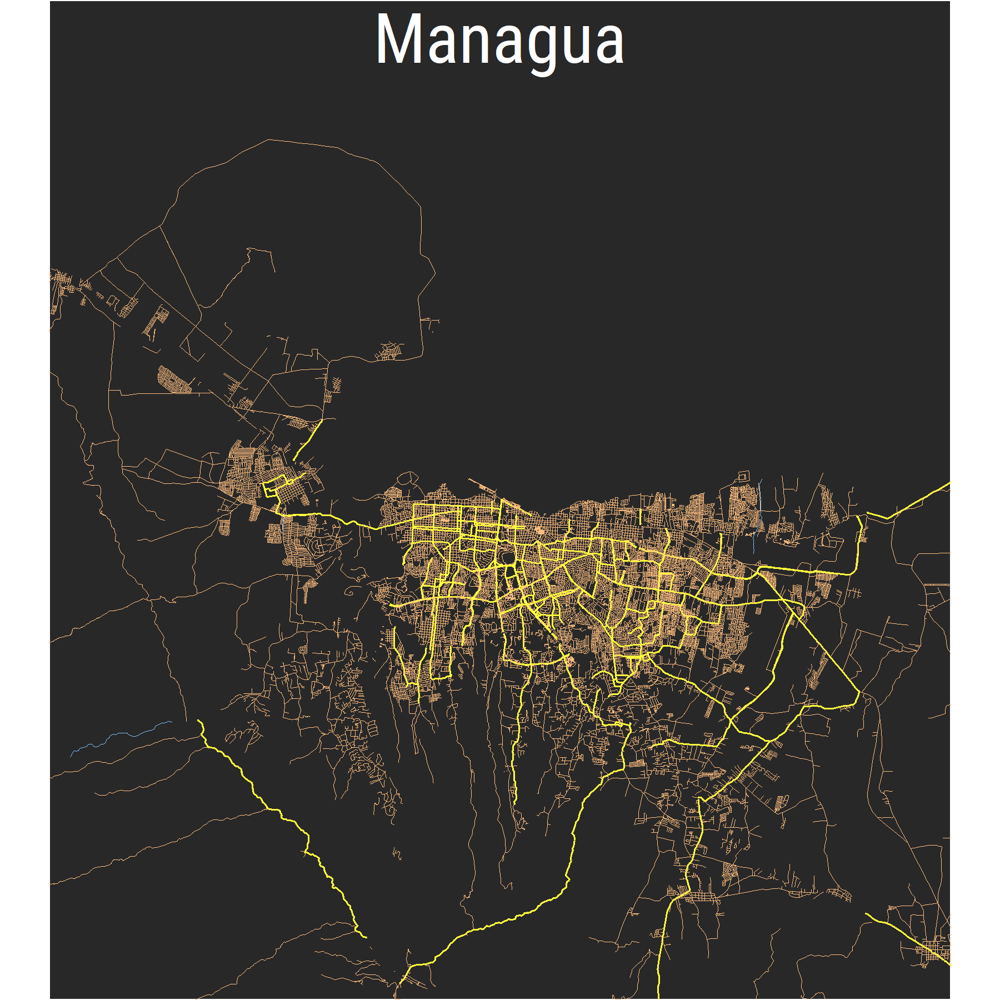

# Open Street Maps Package in R: Examples for Nicaragua

I just followed this [tutorial](https://ggplot2tutor.com/streetmaps/streetmaps/) and recreated all the maps for all the Department seats. Please feel free to contact me if you have any question. 

## Mapas

